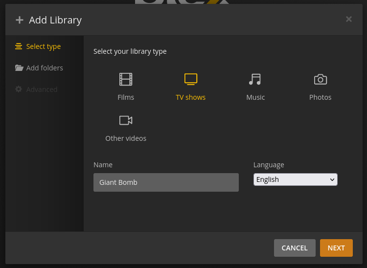
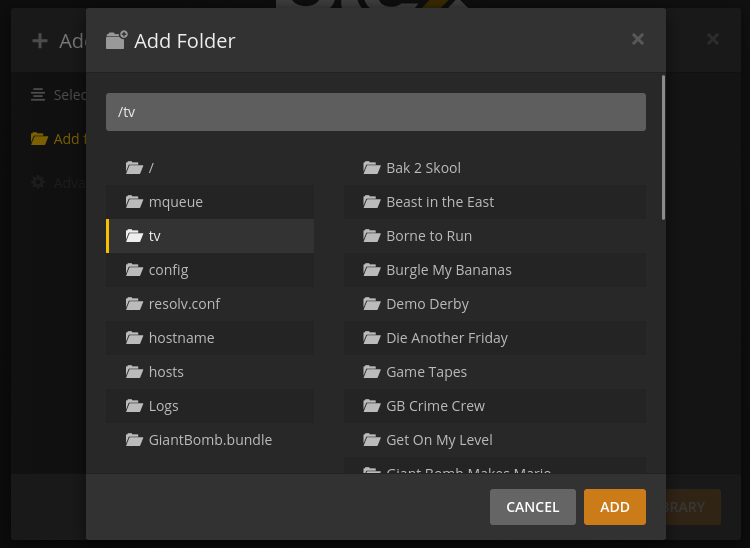
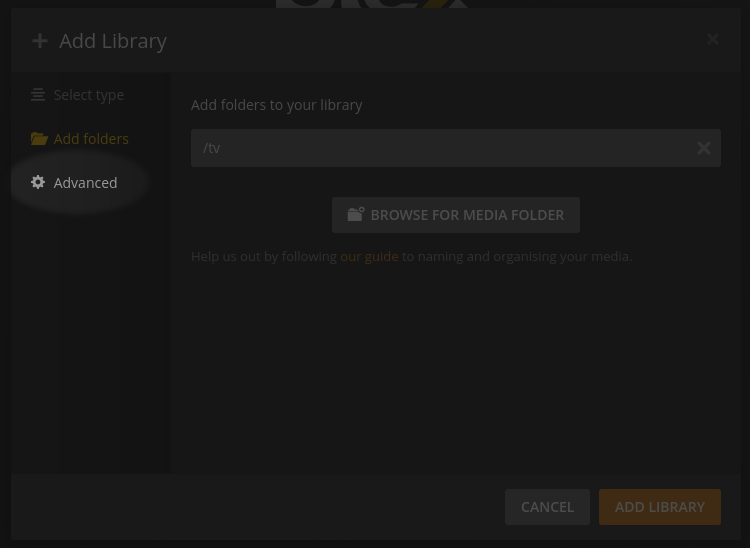
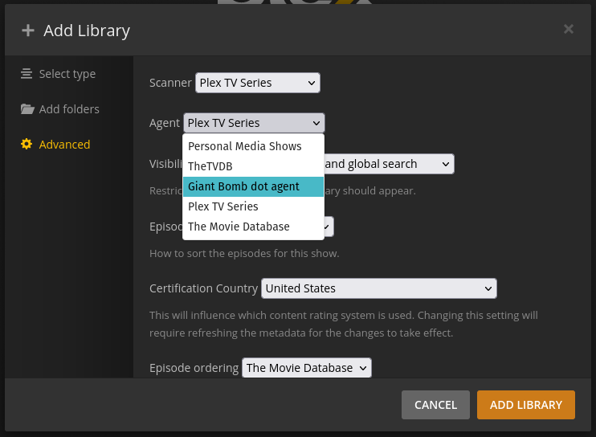
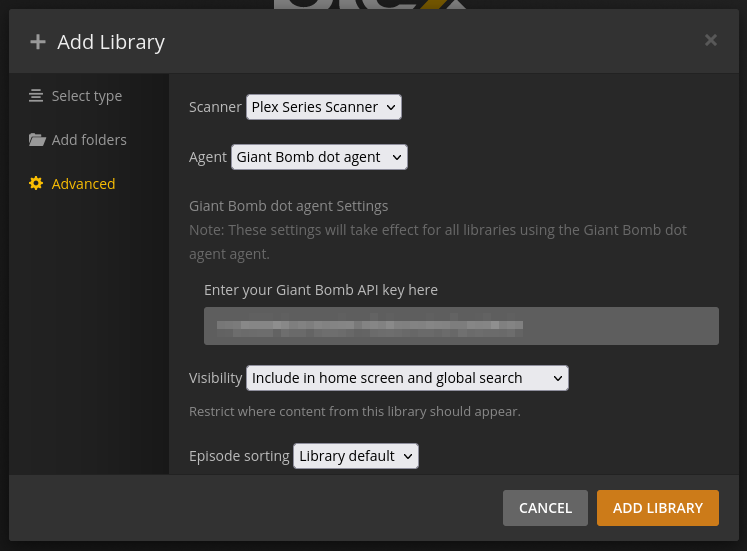

# Giant Bomb dot agent - Plex Metadata Agent for Giant Bomb dot com

Giant Bomb dot agent is a Plex agent for Giant Bomb dot com. It is currently in a very early state, but aims to allow you to add archives of Giant Bomb shows to a Plex library.

## Current limitations

### Matching

Currently, to get shows to match, you'll need files in a traditional Plex Season structure, i.e. divided into `Season xx` folders and files starting with `SxxExx`. As an example:

```text
'./Murder Island/':
'Season 01'

'./Murder Island/Season 01':
"s01e01 201704241458 Murder Island GB's PlayerUnknown's Battlegrounds Battle Stream Combat Test Stream.mp4"
's01e02 201705011811 Murder Island (05-01-2017).mp4'
's01e03 201705081750 Murder Island Return to Murder Island (05-08-2017).mp4'
's01e04 201705151449 Murder Island The Revenge of Murder Island (05-12-2017).mp4'
's01e05 201705221636 Murder Island The Island of Murder Island (05-22-2017).mp4'
's01e06 201706051713 Murder Island Big Trouble on Murder Island.mp4'
's01e07 201706261705 Murder Island Honey, I Shanked the Murder Island!.mp4'
's01e08 201707101528 Murder Island Charlie Murder and the Island Factory.mp4'
's01e09 201707171517 Murder Island The Assassination of Murder Island by the Cowards Giant Bomb.mp4'
's01e10 201707241554 Murder Island Who Framed Murder Island.mp4'
's01e11 201707311754 Murder Island Bring Me the Head of Murder Island.mp4'
's01e12 201708071650 Murder Island 3000 Miles to Murder Island.mp4'
's01e13 201708141344 Murder Island Wet Hot Murder Island.mp4'
's01e14 201708211413 Murder Island To Live and Die on Murder Island.mp4'
's01e15 201708281425 Murder Island The Wizard of Murder Island.mp4'
's01e16 201708281804 Murder Island The Wizard of Murder Island (Director'\''s Cut).mp4'
"s01e17 201709111545 Murder Island Sgt. Ben Pack's Murder Island Club Band.mp4"
's01e18 201709181503 Murder Island Murder-Island.mp4'
's01e19 201709251530 Murder Island My Big Fat Murder Wedding.mp4'
's01e20 201709251802 Murder Island My Big Fat Murder Wedding (Director'\''s Cut).mp4'
"s01e21 201710091516 Murder Island Things to Do on Murder Island When You're Dead.mp4"
's01e22 201804041710 Murder Island Smaller Murder Island.mp4'
's01e23 201807091351 Murder Island (07-09-2018).mp4'
's01e24 201902111650 Murder Island Apex Legends - Advanced Dying Tactics.mp4'
's01e25 201907181718 Murder Island Three Ninjas High Noon at MURDER Mountain.mp4'
"s01e26 201910031400 Murder Island At World's Edge.mp4"
```

You might get lucky with your files, but probably not. I'm hoping that we can either build a renaming tool, or write a Plex scanner to go along with the agent that will recognise multiple naming formats.

### API access

Currently, to get accurate info, you will need an API key with premium access. API keys for accounts without premium will let you get some show info, but episode metadata will be wrong or missing as premium videos do not get returned in requests made with non premium keys.

The hope for the future is to include an API dump so no keys are required.

## Installation

1. Download the latest release from the [releases page](https://github.com/gordonjb/giantbomb.agent/releases).
1. Extract the contents
1. Copy the GiantBomb.bundle folder in it's entirety to your Plex Plugin directory. To find this folder for your platform, consult the [Plex documentation](https://support.plex.tv/articles/201106098-how-do-i-find-the-plug-ins-folder/).
1. Restart your Plex server

## Add a library

1. Add a new Plex TV library:
\

1. Add your media folders:
\

1. **Manually** select "Advanced" from the sidebar on the left instead of "Add Library" on the bottom right:
\

1. In the "Agent" dropdown, select Giant Bomb dot agent as the library agent:
\

1. Configure Giant Bomb dot agent's options to your liking. A Giant Bomb API key must be provided, or lookups won't work (these can be changed at any time):
\

1. Set any other library settings, and then "Add Library".

## Roadmap

Please feel free to [raise issues](https://github.com/gordonjb/giantbomb.agent/issues) if you have enhancement requests/ideas/problems, or to help with outstanding issues.

## Thanks

The [MyAnimeList](https://github.com/Fribb/MyAnimeList.bundle), [The Great Courses](https://github.com/bubonic/TGC.bundle/tree/master/TGC.bundle) & [ZeroQI's YouTube](https://github.com/ZeroQI/YouTube-Agent.bundle) agents were invaluable for getting started and as references to how to do almost anything given the complete lack of Plex documentation!

## Developer Info

### Developing

First, clone this repository, and go into the root folder. The plugin itself is all contained in the [`GiantBomb.bundle`](/GiantBomb.bundle) folder.

The bulk of the code is in [`Contents/Code/__init__.py`](/GiantBomb.bundle/Contents/Code/__init__.py).

### Testing in Docker

To test the agent, I use the included [Docker Compose file](/test/docker-compose.yml) to bring up a Docker instance of Plex. A new TV Shows library can then be created to use Giant Bomb dot agent as the Agent, and automatching and manual matching can be tested using your test library.

From the `test` directory run `docker-compose up -d` to bring up Plex. Go to [localhost:32400/web/index.html](http://localhost:32400/web/index.html) and run through the server setup steps to begin testing. Logs will be available in [test/.plexlogs](/test/.plexlogs). To reset your server state, stop the container using `docker-compose down -v`.
